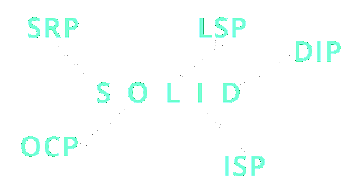

<!-- 
https://docs.github.com/pt/get-started/writing-on-github/getting-started-with-writing-and-formatting-on-github/basic-writing-and-formatting-syntax 
https://www.techtarget.com/searchapparchitecture/feature/An-intro-to-the-5-SOLID-principles-of-object-oriented-design
https://blog.knoldus.com/why-we-need-solid-principles-and-its-types/
https://mermaid.js.org/syntax/mindmap.html

  

-->

# SOLID Principles Examples Repository

Welcome to the SOLID Principles Examples repository! This collection of code samples and demonstrations is designed to help developers understand and apply the SOLID principles in their software design. Dive into these practical examples to enhance your knowledge of Single Responsibility, Open-Closed, Liskov Substitution, Interface Segregation, and Dependency Inversion principles. Explore how to write clean, maintainable code that adapts and scales effortlessly.

## Table of Contents

- [Single Responsibility Principle (SRP)](#single-responsibility-principle-srp)
- [Open/Closed Principle (OCP)](#openclosed-principle-ocp-ocp)
- [Liskov Substitution Principle (LSP)](#liskov-substitution-principle-lsp)
- [Interface Segregation Principle(ISP)](#interface-segregation-principle-isp)
- [Dependency Inversion Principle(DIP)](#Dependency-inversion-principle-dip)

## Single Responsibility Principle (SRP)
The Single Responsibility Principle (SRP), one of the five SOLID principles, stipulates that a class, entity, component, or function should have a single, well-defined responsibility. When programming following SRP, it becomes possible to create independent and isolated entities, facilitating code reusability, refactoring, and automated testing, resulting in fewer defects. Even in situations where errors occur, isolating and correcting the problem becomes more straightforward.

The approach of single responsibility components contributes to more efficient code maintenance since code units are smaller and, therefore, more easily analyzed within defined scopes. To determine the boundaries of a component's responsibility, it is recommended to name it according to its specific functionalities. The presence of terms like "and... something" or excessively long names may indicate the need to revisit and redefine the tasks assigned to that entity. This principle promotes a clear and cohesive code organization, facilitating the development and maintenance of software systems.

> [!NOTE]
> - **Identification of Responsibilities**: Ensure that you have clearly defined the responsibilities of each class, component, or function. Each should have a single, well-defined responsibility.
> - **Proper Division**: Avoid overloading a single class or function with too many responsibilities. If you notice a class growing too large, consider dividing its responsibilities into smaller classes.
> - **Meaningful Naming**: Provide meaningful names for your classes, methods, and functions. Names should clearly reflect the entity's responsibility.
> - **Unit Testing**: When writing tests for your classes and functions, focus on validating their specific responsibilities. This helps ensure compliance with the SRP.
> - **Ongoing Review**: Regularly review your code to ensure that classes still have a single responsibility. As software evolves, new responsibilities may inadvertently be introduced.
> - **Refactoring**: Don't be afraid to refactor your code if you identify SRP violations. Refactoring is an important practice to maintain code quality.
> - **Understanding Business Logic**: Gain a good understanding of the domain's business rules you're programming for. This helps in properly defining responsibilities.
> - **Design Patterns**: Be aware of software design patterns such as the Strategy pattern that can assist in adhering to the SRP.
> - **Documentation**: Document the purpose and responsibility of each class or function. This can be helpful for other developers interacting with the code.
> - **Dependency Evaluation**: Ensure that the dependencies of a class are relevant to its responsibility. Avoid having a class depend on others that don't make sense within its sphere of responsibility.

Remember, following the SRP doesn't necessarily mean creating a large number of tiny classes. Instead, it's about finding a balance where each class has a clear and justifiable responsibility within the context of the system. This results in more cohesive, understandable, and maintainable code.

## Open/Closed Principle (OCP)

## Liskov Substitution Principle (LSP)

## Interface Segregation Principle (ISP)

## Dependency Inversion Principle (DIP)

