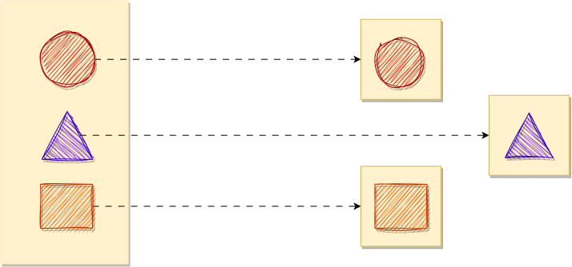
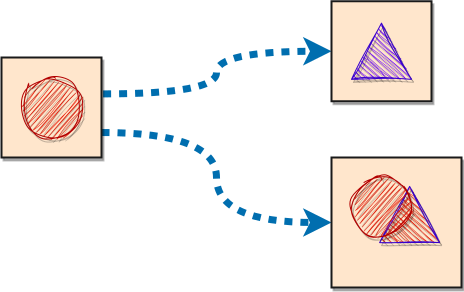

<!-- 
https://docs.github.com/pt/get-started/writing-on-github/getting-started-with-writing-and-formatting-on-github/basic-writing-and-formatting-syntax 
https://www.techtarget.com/searchapparchitecture/feature/An-intro-to-the-5-SOLID-principles-of-object-oriented-design
https://blog.knoldus.com/why-we-need-solid-principles-and-its-types/
https://mermaid.js.org/syntax/mindmap.html

  

-->

# SOLID Principles Examples Repository

Welcome to the SOLID Principles Examples repository! This collection of code samples and demonstrations is designed to help developers understand and apply the SOLID principles in their software design. Dive into these practical examples to enhance your knowledge of Single Responsibility, Open-Closed, Liskov Substitution, Interface Segregation, and Dependency Inversion principles. Explore how to write clean, maintainable code that adapts and scales effortlessly.

## Table of Contents

- [Single Responsibility Principle (SRP)](#single-responsibility-principle-srp)
- [Open/Closed Principle (OCP)](#openclosed-principle-ocp)
- [Liskov Substitution Principle (LSP)](#liskov-substitution-principle-lsp)
- [Interface Segregation Principle(ISP)](#interface-segregation-principle-isp)
- [Dependency Inversion Principle(DIP)](#dependency-inversion-principle-dip)
- [[Planned Topic] - Benefits and Advantages](#benefits-and-advantages)
- [[Planned Topic] - Challenges and Pitfalls](#challenges-and-pitfalls)
- [[Planned Topic] - Relation to Other Principles](#relation-to-other-principles)
- [[Planned Topic] - Tools and Frameworks](#tools-and-frameworks)
- [[Planned Topic] - Relation to Other Principles](#relation-to-other-principles)
- [[Planned Topic] - Interrelationships Between SOLID Principles](#interrelationships-between-solid-principles)

## Single Responsibility Principle (SRP)

The Single Responsibility Principle (SRP), one of the five SOLID principles, stipulates that a class, entity, component, or function should have a single, well-defined responsibility. When programming following SRP, it becomes possible to create independent and isolated entities, facilitating code reusability, refactoring, and automated testing, resulting in fewer defects. Even in situations where errors occur, isolating and correcting the problem becomes more straightforward.
  

The approach of single responsibility components contributes to more efficient code maintenance since code units are smaller and, therefore, more easily analyzed within defined scopes. To determine the boundaries of a component's responsibility, it is recommended to name it according to its specific functionalities. The presence of terms like "and... something" or excessively long names may indicate the need to revisit and redefine the tasks assigned to that entity. This principle promotes a clear and cohesive code organization, facilitating the development and maintenance of software systems.

> [!NOTE]
> - ***Identification of Responsibilities***: Ensure that you have clearly defined the responsibilities of each class, component, or function. Each should have a single, well-defined responsibility.
> - ***Proper Division***: Avoid overloading a single class or function with too many responsibilities. If you notice a class growing too large, consider dividing its responsibilities into smaller classes.
> - ***Meaningful Naming***: Provide meaningful names for your classes, methods, and functions. Names should clearly reflect the entity's responsibility.
> - ***Unit Testing***: When writing tests for your classes and functions, focus on validating their specific responsibilities. This helps ensure compliance with the SRP.
> - ***Ongoing Review***: Regularly review your code to ensure that classes still have a single responsibility. As software evolves, new responsibilities may inadvertently be introduced.
> - ***Refactoring***: Don't be afraid to refactor your code if you identify SRP violations. Refactoring is an important practice to maintain code quality.
> - ***Understanding Business Logic***: Gain a good understanding of the domain's business rules you're programming for. This helps in properly defining responsibilities.
> - ***Design Patterns***: Be aware of software design patterns such as the Strategy pattern that can assist in adhering to the SRP.
> - ***Documentation***: Document the purpose and responsibility of each class or function. This can be helpful for other developers interacting with the code.
> - ***Dependency Evaluation***: Ensure that the dependencies of a class are relevant to its responsibility. Avoid having a class depend on others that don't make sense within its sphere of responsibility.

Remember, following the SRP doesn't necessarily mean creating a large number of tiny classes. Instead, it's about finding a balance where each class has a clear and justifiable responsibility within the context of the system. This results in more cohesive, understandable, and maintainable code.

## Open/Closed Principle (OCP)

The Open/Closed Principle (OCP) is one of the five principles of SOLID, a set of software design guidelines aimed at creating more efficient, scalable, and maintainable systems. OCP states that software entities (such as classes, modules, and functions) should be open for extension but closed for modification.
  

  

In simpler terms, this means that you should be able to extend the behavior of a software component without having to change its original source code. Instead, you should be able to create new classes or modules that inherit from or connect to the existing component to add functionality. This is similar to the way Object-Relational Mapping (ORM) tools allow you to connect to different databases in an application without altering the source code or how browser plugins can be installed without modifying the browser's source code.
  
 

The key advantages of OCP include:

1. **Simplified Maintenance:** By avoiding the need to modify existing code to add new features, there is a reduced risk of introducing errors or affecting the current operation of the software.

2. **Code Reusability:** The ability to extend existing components allows for their reuse in different contexts without modification.

3. **Scalability:** OCP enables the modular addition of features, making the software more scalable.

To apply the Open/Closed Principle, various techniques can be used, such as inheritance, interfaces, dependency injection, and design patterns like the Strategy Pattern. These techniques make it possible to add new behaviors to the system without altering the existing code, resulting in a more flexible and adaptable software system.

>[!note]
> - ***Use Abstraction:*** Define abstractions, such as interfaces or abstract classes, to encapsulate the core behavior you want to extend. This abstraction should remain stable while allowing new implementations to be added.
> - ***Employ Polymorphism:*** Utilize [polymorphism](https://en.wikipedia.org/wiki/Polymorphism_(computer_science)#:~:text=The%20concept%20is%20borrowed%20from,set%20of%20individually%20specified%20types.) to enable different implementations of the same abstraction to coexist. This allows you to extend the software's functionality by adding new classes that adhere to the established abstraction.
> - ***Create Extension Points:*** Design your software with clearly defined extension points or hooks that enable new functionality to be added without modifying existing code. These hooks should be part of the abstraction.
> - ***Favor Composition:*** Consider using composition over inheritance when it makes sense. Instead of inheriting from existing classes, encapsulate them as components in new classes. This promotes more flexible and interchangeable components.
> - ***Design Patterns:*** Familiarize yourself with design patterns that promote the OCP, such as the Strategy Pattern or the Decorator Pattern. These patterns provide structured ways to extend functionality.
> - ***Dependency Injection:*** Implement dependency injection to inject dependencies into your classes. This enables you to change or extend the behavior of a class by simply injecting different dependencies without modifying the class itself.
> - ***Automated Testing:*** Ensure that you have a robust suite of automated tests in place. This is particularly important when you're extending or introducing new implementations. Tests help catch regressions and ensure that your extensions don't break existing functionality.
> - ***Documentation:*** Clearly document the extension points and the conventions for creating new extensions. This documentation will guide other developers in extending your software correctly.
> - ***Code Reviews:*** Enforce code reviews to assess how effectively OCP is being applied. Code reviews provide opportunities to ensure that extensions follow the principles and don't accidentally introduce violations.
> - ***Continuous Integration:*** Integrate OCP adherence into your continuous integration process. Set up checks and automated tools that verify OCP compliance in the codebase.
> - ***Educate the Team:*** Ensure that your development team understands the principles and benefits of OCP. This knowledge will lead to better-designed and more maintainable software.
> - ***Refactor When Necessary:*** Regularly review the codebase and identify opportunities to refactor or introduce new abstractions to better adhere to the OCP. Over time, software requirements may change, and adjustments will be needed.

By following these recommendations, you can apply the Open/Closed Principle effectively and build more extensible, maintainable, and adaptable software systems.

## Liskov Substitution Principle (LSP)
The Liskov Substitution Principle (Liskov Substitution Principle - LSP) is one of the five principles of SOLID, a set of software design guidelines aimed at ensuring consistent and reliable code extensibility. LSP states that if a class is derived from another through inheritance, the object or instance resulting from the subclass should be able to replace the object from the parent class without causing program breakage. In simpler terms, a subclass should not introduce unexpected behaviors or exceptions that are incompatible with the parent class.

Effectively applying LSP encourages the precise definition of abstractions at different levels of the class hierarchy, promoting consistency and coherence among them. This leads us to carefully consider what a parent class should provide to its subclasses, as this is essential for adhering to the Open/Closed Principle (Open/Closed Principle - OCP).

The Liskov Principle suggests that we should not allow subclasses to exhibit unexpected behaviors, such as an essential method that exists at one point in the inheritance hierarchy but raises exceptions at a lower point. Instead, subclasses should be designed appropriately and in a manner that is compatible with the parent class, ensuring that object replacement occurs consistently and without unexpected side effects. LSP is essential for creating robust and predictable class hierarchies in software systems.

>[!note]
> - ***Understand the Class Hierarchy***: Before creating complex class hierarchies, thoroughly understand the inheritance structure and how subclasses relate to the parent class.
> - ***Avoid Unexpected Exceptions***: Do not introduce exceptions or unexpected behaviors in subclasses that break the expectations established by the parent class.
> - ***Follow Well-Defined Contracts***: Define clear contracts and interfaces for your base classes. Subclasses should strictly adhere to these contracts.
> - ***Test Substitution***: Ensure that all subclasses are tested for their ability to replace objects from the parent class without causing issues.
> - **Do Not Violate Constraints**: Subclasses should not violate or relax constraints imposed by the parent class. Substitution should maintain the same semantics.
> - ***Be Type-Aware***: When creating subclasses, carefully consider types and ensure that substitution does not affect type semantics.
> - ***Avoid Multiple Inheritance***: Avoid multiple inheritance, as it can complicate the application of the LSP.
> - ***Utilize Interfaces***: Using interfaces may be more appropriate in certain cases than inheritance. Evaluate whether an interface would be a more suitable choice for defining contracts.
> - ***Document and Communicate***: Explicitly document expected contracts and inheritance constraints, and communicate these requirements to the entire team.
> - ***Review and Validate***: Conduct code reviews and validations to ensure that the LSP is respected throughout the project.

The rigorous application of LSP can lead to more robust class hierarchies and software systems that are more predictable and scalable.

## Interface Segregation Principle (ISP)
The ISP dictates that classes should not be forced to implement interfaces that contain methods irrelevant to their specific functionalities. When this principle is violated, classes that do not require a complete set of methods from the interface are compelled to create empty implementations (i.e., methods without actual functionality), which contradicts the Single Responsibility Principle (SRP).

The ISP focuses on the organization of interfaces, ensuring they are divided into logical and cohesive sets of methods. This provides greater flexibility to classes, allowing them to select and implement only the interfaces directly relevant to their needs, thus avoiding the burden of unnecessary methods. This principle promotes a leaner and more cohesive architecture, making the code cleaner, more understandable, and adaptable to future changes.

Adhering to the ISP not only enhances the structure and clarity of software but also helps fulfill the other SOLID principles, creating more modular and extensible systems. This results in more sustainable code that is easier to maintain and enhance over time.

>[!note]
> - ***Specific Interfaces***: Create interfaces tailored to the needs of the classes that implement them. Avoid generic interfaces that contain methods irrelevant to all classes.
> - ***Semantic Consistency***: Ensure that the methods in an interface have semantic consistency, meaning they are related in terms of functionality. This helps maintain the clarity and understanding of interfaces.
> - ***Responsibility Separation***: If a class has multiple distinct responsibilities, consider splitting it into smaller classes, each with its own interface. This helps avoid large and complex interfaces.
> - ***Flexible Design***: Plan interfaces to allow new classes to be added without the need to change existing interfaces. This keeps the system flexible and extensible.
> - ***Testability***: Segregated interfaces make it easier to create specific unit tests for each class. This makes the code more testable and aids in the early detection of issues.
> - ***Clear Documentation***: Clearly document your interfaces and provide information on how classes should implement them. This helps other developers understand the purpose and usage of the interfaces.
> - ***Code Review***: Conduct code reviews to ensure that classes are following the interfaces properly and not implementing unnecessary methods.
> - ***Conscious Refactoring***: Be willing to refactor interfaces as the system evolves. If new requirements necessitate adding or removing methods in an interface, do so consciously to avoid breaking existing classes.
> - ***Continuous Learning***: Stay updated on best practices for interface design and SOLID principles to enhance your software design.

It's worth noting that the ISP aims to promote cohesion and clarity in interface design by avoiding "bloated" interfaces that force classes to implement unnecessary methods. This results in more organized and flexible systems.

## Dependency Inversion Principle (DIP)
The Dependency Inversion Principle (DIP) emphasizes the importance of reorganizing dependency relationships among different components or modules within a software system.

DIP advocates the need to reverse the direction of dependencies so that high-level modules do not depend on low-level modules. In a traditional software architecture, high-level modules, which are more abstract and general components of the system, often depend on low-level modules, which are more specific and concrete components. This direct dependency of high-level modules on low-level modules can make the system rigid and challenging to maintain, as any changes in low-level modules can directly affect high-level modules. Instead, both should depend on abstractions, providing greater flexibility, code reuse, and easing system maintenance.

The core of DIP is to create a code structure in which modules are independent and can be combined flexibly, allowing for the introduction of new modules or replacement of existing modules without significantly impacting the rest of the system. This principle helps make software systems more robust, extensible, and easier to maintain.

This makes the system easier to maintain and modify, as changes to low-level modules do not directly affect high-level modules, provided they continue to adhere to the contract defined by abstractions.

>[!note]
> - ***Identify High-Level and Low-Level Modules***: Clearly distinguish between high-level and low-level modules in your software. High-level modules represent more abstract, generalized components, while low-level modules are specific and concrete.
> - ***Define Abstractions***: Create well-defined abstractions (interfaces or abstract classes) that represent the common contract shared by modules. These abstractions should outline the expected behaviors and operations.
> - ***Implement Abstractions***: Ensure that both high-level and low-level modules implement these abstractions. This allows for consistent interaction based on a common interface.
> - ***Inversion of Control (IoC) Containers***: Consider using IoC containers or frameworks, such as Spring or .NET Core's built-in DI, to manage dependencies and facilitate inversion of control.
> - ***Dependency Injection***: Apply the Dependency Injection (DI) pattern to provide the required dependencies to high-level modules. This helps invert the dependency and makes the high-level module independent of low-level details.
> - ***Adhere to the "Single Responsibility Principle"***: Ensure that each module, whether high-level or low-level, follows the Single Responsibility Principle (SRP). Modules should have a single, well-defined purpose.
> - ***Documentation***: Document the purpose and responsibilities of each module and its adherence to abstractions. This aids in maintaining a clear structure and simplifies future updates.
> - ***Unit Testing***: Implement unit tests for each module, verifying that they adhere to their respective abstractions and produce the expected results. This helps ensure correct implementations and smoother integration.
> - ***Refactor When Necessary***: Periodically review and refactor your codebase to maintain adherence to DIP and other SOLID principles.
> - ***Education and Training***: Train your development team in DIP and other SOLID principles, encouraging best practices for software design.

By following these recommendations, you can effectively apply the Dependency Inversion Principle in your software projects, resulting in more flexible, maintainable, and scalable code.

## Benefits and Advantages
Explain the benefits of following each principle. This may include increased maintainability, ease of extension, error reduction, greater code reuse, among others.

## Challenges and Pitfalls
Discuss potential challenges that developers may face when applying these principles. For instance, common implementation issues and how to avoid them.

## Tools and Frameworks
Mention tools, libraries, and frameworks that can assist in more effective application of these principles. For example, dependency injection frameworks, linters, or IDEs with specific features.

## Relation to Other Principles
Explore how SOLID principles relate to other software design concepts, such as design patterns, architectural principles, and general best practices.

## Interrelationships Between SOLID Principles
Discusses the interrelationships between the SOLID principles.

