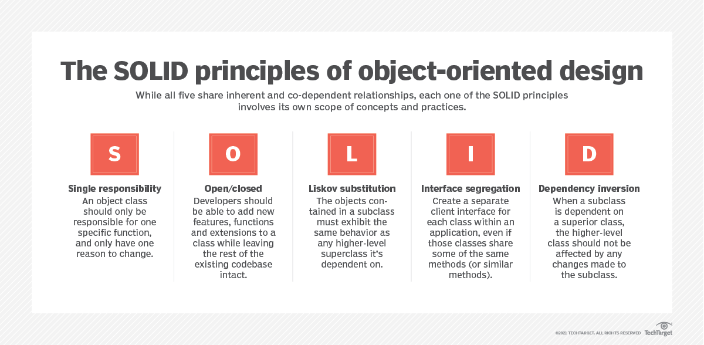

<!-- 
https://docs.github.com/pt/get-started/writing-on-github/getting-started-with-writing-and-formatting-on-github/basic-writing-and-formatting-syntax 
https://www.techtarget.com/searchapparchitecture/feature/An-intro-to-the-5-SOLID-principles-of-object-oriented-design
https://blog.knoldus.com/why-we-need-solid-principles-and-its-types/
-->

  


# SOLID
### SOLID Principles Examples Repository

Welcome to the SOLID Principles Examples repository! This collection of code samples and demonstrations is designed to help developers understand and apply the SOLID principles in their software design. Dive into these practical examples to enhance your knowledge of Single Responsibility, Open-Closed, Liskov Substitution, Interface Segregation, and Dependency Inversion principles. Explore how to write clean, maintainable code that adapts and scales effortlessly.

For more information on the `SOLID` principles, visit the official SOLID principles website at https://solidprinciples.com/.

Hello world

### 1 - Single Responsibility Principle (SRP)
This principle states that a class should have only one reason to change, meaning it should have only one responsibility or job. It helps to keep your classes focused and easier to understand.

Correct usage of the Single Responsibility Principle (SRP) 
```csharp
using System;

// Class following the SRP (Single Responsibility Principle)
class Order
{
    public string OrderId { get; set; }
    public decimal TotalAmount { get; set; }
    public DateTime OrderDate { get; set; }

    public void SaveOrderToDatabase()
    {
        // Logic for saving the order to the database
        Console.WriteLine("Order saved to the database.");
    }
}

// Separate class to handle email notifications
class EmailService
{
    public void SendOrderConfirmationEmail(Order order)
    {
        // Logic for sending the order confirmation email
        Console.WriteLine("Order confirmation email sent for order " + order.OrderId);
    }
}

class Program
{
    static void Main()
    {
        Order order = new Order
        {
            OrderId = "12345",
            TotalAmount = 100.0m,
            OrderDate = DateTime.Now
        };

        order.SaveOrderToDatabase();

        EmailService emailService = new EmailService();
        emailService.SendOrderConfirmationEmail(order);
    }
}

```


### 2 - Open/Closed Principle (OCP)
The OCP encourages software entities (classes, modules, functions) to be open for extension but closed for modification. This means that you should be able to add new functionality without altering existing code. It promotes code reusability and minimizes the risk of introducing new bugs.

### 3 - Liskov Substitution Principle (LSP)
Named after Barbara Liskov, this principle states that objects of a derived class should be able to replace objects of the base class without affecting the correctness of the program. In other words, derived classes should extend, not break, the behavior of base classes.

### 4 - Interface Segregation Principle (ISP)
The ISP suggests that clients (users of an interface) should not be forced to depend on interfaces they do not use. It's better to have multiple small, specific interfaces rather than a large, monolithic one. This reduces the impact of changes and dependencies.

### 5 - Dependency Inversion Principle (DIP)
The DIP emphasizes high-level modules should not depend on low-level modules but should depend on abstractions. It also states that abstractions should not depend on details, and details should depend on abstractions. This encourages decoupling and promotes a more flexible, maintainable system.


- [x] #739
- [ ] https://github.com/octo-org/octo-repo/issues/740
- [ ] Add delight to the experience when all tasks are complete :tada:

> [!NOTE]
> Highlights information that users should take into account, even when skimming.

> [!IMPORTANT]
> Crucial information necessary for users to succeed.

> [!WARNING]
> Critical content demanding immediate user attention due to potential risks.


Here is a simple flow chart:


